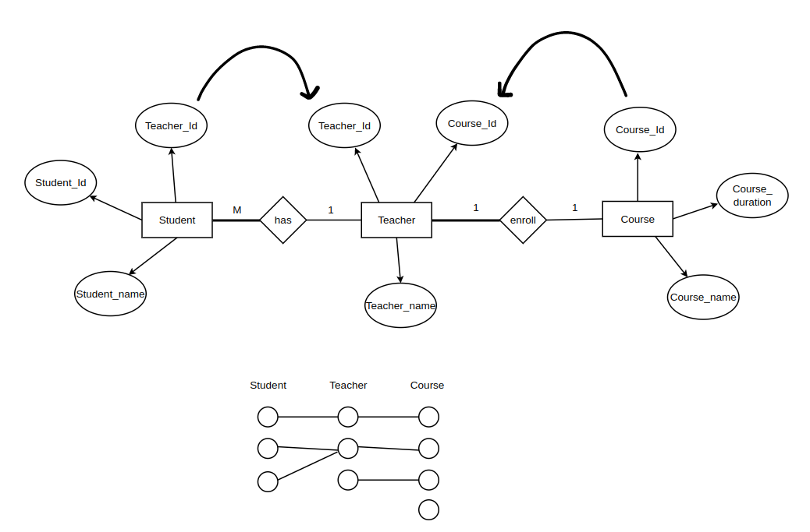
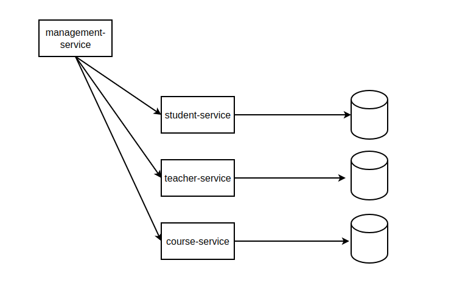
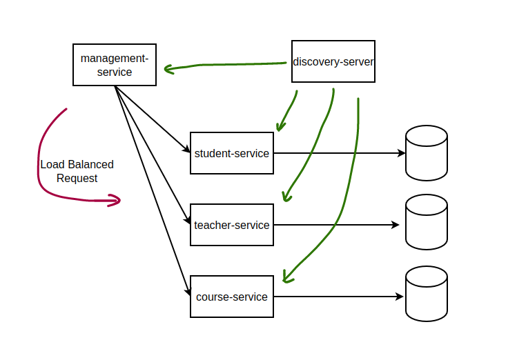
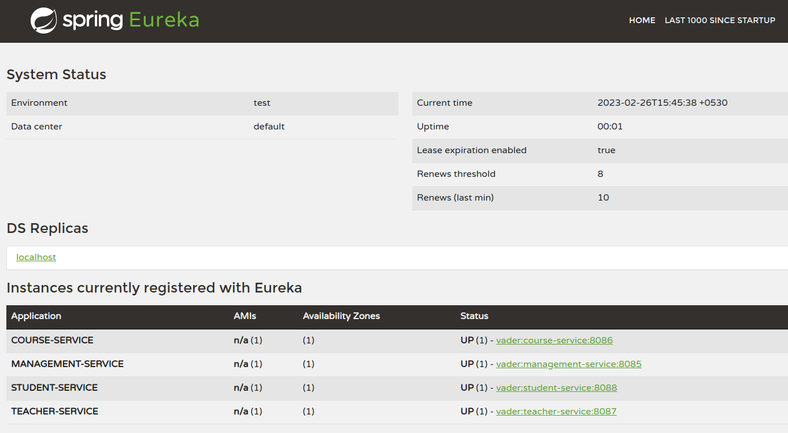

# school system - spring microservices

## 1. Relationship ERD model

## 2. Snapshot

Each of the Student-Service, Teacher-Service, and Course-Service operates independently as a separate service, communicating with its own database and managing data related to students, teachers, and courses. The Management-Service utilizes a web client to make API calls to these three services, retrieving student names, teacher names, and corresponding course information based on student IDs.

However, hard-coding the API call URLs in the Management-Service is considered a bad practice for several reasons.

1. URLs might change which can lead to us changing it inside our code.
2. Dynamic URLs in the cloud.
3. Load balancing is impossible with this method.
4. We can have multiple environments.

## 3. Discovery Server

We have a design pattern called Service Discovery, an alternative to hard-coding URLs is to store them as application name in application.property file and use them as environment variables.

Using Eureka involves three basic steps:

1. Setting up the Eureka server.
2. Registering microservices to the Service Discovery.
3. Consuming the response from the discovery to find a server.

