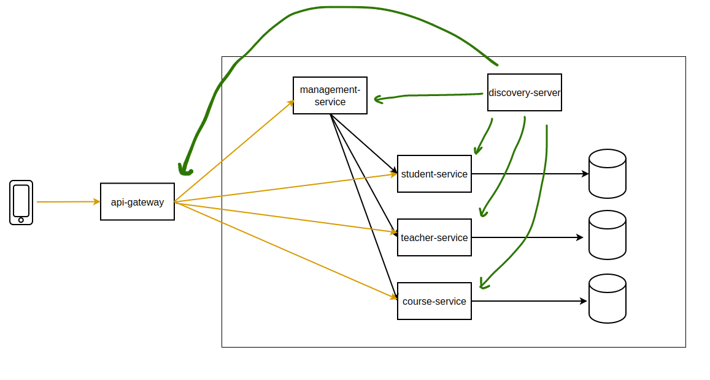

# school system - spring microservices

## 1. Relationship ERD model

## 2. Snapshot

Each of the Student-Service, Teacher-Service, and Course-Service operates independently as a separate service, communicating with its own database and managing data related to students, teachers, and courses. The Management-Service utilizes a web client to make API calls to these three services, retrieving student names, teacher names, and corresponding course information based on student IDs.

However, hard-coding the API call URLs in the Management-Service is considered a bad practice for several reasons.

1. URLs might change which can lead to us changing it inside our code.
2. Dynamic URLs in the cloud.
3. Load balancing is impossible with this method.
4. We can have multiple environments.

## 3. Discovery Server

We have a design pattern called Service Discovery, an alternative to hard-coding URLs is to store them as application name in application.property file and use them as environment variables.

Using Eureka involves three basic steps:

1. Setting up the Eureka server.
2. Registering microservices to the Service Discovery.
3. Consuming the response from the discovery to find a server.

## 4. API Gateway

An API Gateway is a key component in a microservices architecture that sits between the microservices and the external clients, providing a single point of entry for all requests. It is responsible for routing incoming requests to the appropriate microservice, performing authentication and authorization, load balancing, and other tasks.

## 5. Circuit Breaker

In Spring microservices, a circuit breaker is a design pattern used to prevent cascading failures in a distributed system.

When one microservice fails, it can cause a chain reaction of failures in other dependent microservices, leading to a system-wide outage. Circuit breakers are used to prevent this by intercepting calls to dependent microservices and determining whether they are likely to fail. If a failure is likely, the circuit breaker opens and returns an error response to the calling service, rather than allowing the call to propagate to the dependent service.

The circuit breaker will periodically try to close the circuit and allow calls to pass through again, but if the dependent service is still unavailable, the circuit will remain open. This helps to prevent system-wide failures and allows the system to recover more quickly from outages.
